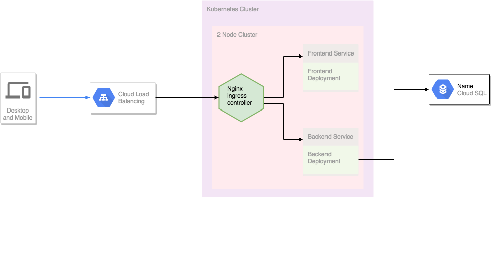

# Travela Deployment scripts

## Infrastructure

When a user first accesses Travela's URL, he/she hits the load balancer which allows external traffic into the cluster. The load balancer forwards the traffic to the Nginx ingress controller, which then forwards the traffic to either the frontend or the backend based on the user's request which is determined by the URL.

As shown in the diagram, there are two more communications that occur; frontend talks with the backend and the backend communicates with the database.
